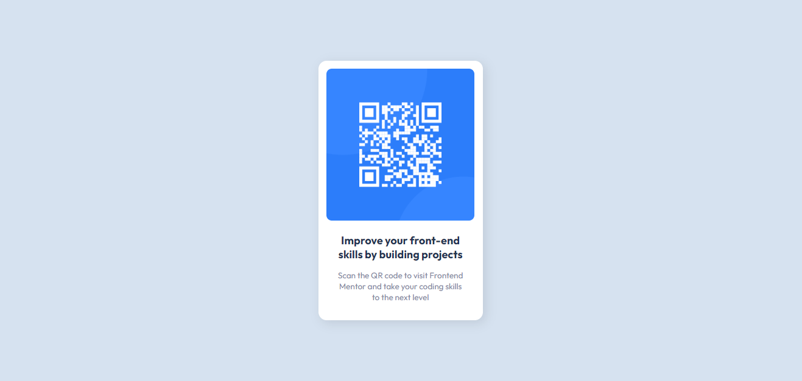

# Frontend Mentor - QR code component solution

This is a solution to the [QR code component challenge on Frontend Mentor](https://www.frontendmentor.io/challenges/qr-code-component-iux_sIO_H).

## Screenshot

## Links
- Solution URL: [https://www.frontendmentor.io/solutions/qr-component-2qMFQHp2rF](https://www.frontendmentor.io/solutions/qr-component-2qMFQHp2rF)
- Live Site URL: [https://pricard0.github.io/qr-code-component-main/](https://pricard0.github.io/qr-code-component-main/)

## My process
This is my first front-end project. My first time using flexbox. I think I managed to put into practive almost everything I learned. It took me around two hours at most to finish the project. Probably if I do it again next week I could get it in 30 minutes.

## Built with
- Basic HTML
- Basic CSS
- Flexbox

## Author
- Github - [P. Ricardo ](https://github.com/pRicard0)
- Frontend Mentor - [@pRicard0](https://www.frontendmentor.io/profile/pRicard0)